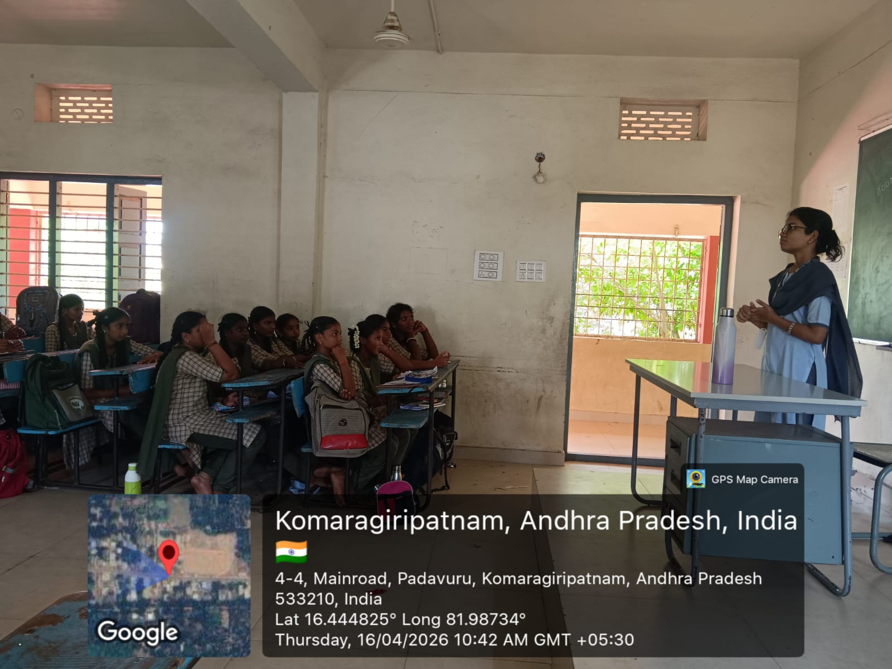
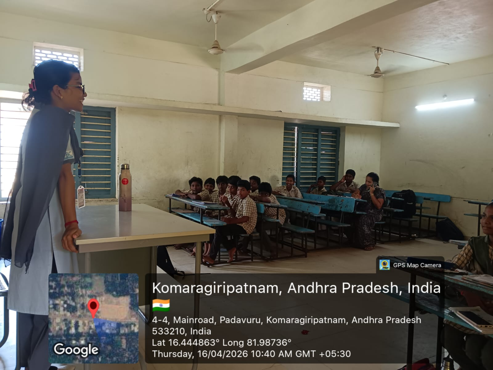

# Community Service Project
## Career Awareness and Goal Setting

This project was conducted at Komaragiripatnam, a rural village where traditional beliefs and socio-economic challenges still influence education, especially for girls. In many families, there is a strong perception that girls should discontinue their education after the 10th grade and get married early. As a result, we observed that several girls were either irregular in school or had already dropped out.

Understanding this situation, our team focused specifically on students of 8th and 9th classes, as this stage is critical in shaping their future decisions.

## 📍 Project Location
Zilla Parishad High School Komaragiripatnam, East Godavari, Andhra Pradesh, India.

## 📅 Duration
March 2026 – April 2026

## 🎯 Our Approach

Instead of general sessions, we conducted targeted awareness and motivational interactions, especially with girl students. We discussed:

- Why education is important for independence and self-growth
- The long-term impact of early marriage on opportunities
- Different career paths available after schooling
- The importance of setting goals at an early stage

We made the sessions interactive by encouraging students to share their thoughts, dreams, and concerns. Many girls initially hesitated to speak, but gradually opened up during discussions.

## 🎯 Objective
To create awareness among rural students about:
- Importance of education
- Career opportunities
- Goal setting

## 🛠 Activities Conducted
- Student interaction sessions
- Career awareness programs
- Goal setting guidance
- Time management training

## 🌱 Impact Created

Through these sessions:

- Students began to understand the value of continuing education
- Many girls expressed interest in pursuing higher studies
- Awareness about career options increased significantly
- Confidence levels improved, especially among girl students

This experience highlighted how small awareness efforts can bring meaningful change in rural communities. This project was not just about teaching, it was about understanding real societal challenges and trying to address them at the grassroots level. It gave us insight into the importance of education, gender equality, and the role we can play in shaping a better future for the next generation.

## 📄 Project Report
[Click here to view full report](./Career-Awareness-CSP-Report.pdf)

## 📸 Project Activities

### Interaction with Students
 

### Career Awareness Session
 
